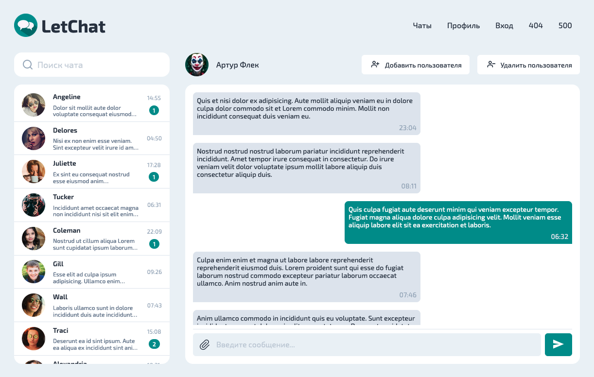

<h1 align="center">
    
     
    LetChat
</h1>

    

## О проекте

LetChat — это приложение чата, но пока на начальной стадии разработки.
Сейчас готовы статические страницы для авторизации/регистрации, основная страница с чатами, настройки профиля, а также страницы с ошибками 404/500.
Реализована валидация полей при событиях _blur_ и _submit_. Если все поля корректно заполнены, то на submit в консоль выводится объект с заполненными
данными.
В разработке используется своя реализация жизненного цикла компонент на чистом JS в связке с паттерном шины событий.
Также для будущего взаимодействия с API реализован класс HTTPTransport основе XMLHttpRequest.

В проекте используются:

- [**Макеты в Figma**](https://www.figma.com/file/fkWCkwhqOUHU1nBjMGgGEP/LetChat?node-id=0%3A1)
- [**Handlebars**](https://handlebarsjs.com) — шаблонизатор HTML
- [**Typescript**](https://www.typescriptlang.org) — надстройка на JS для статической типизации
- [**PostCSS**](https://postcss.org) — обработка CSS
- [**ESLint**](https://eslint.org) и [**stylelint**](https://stylelint.io) — статический анализ кода
- [**Parcel**](https://parceljs.org) — сборка проекта
- Деплоится всё на [**Netlify**](https://www.netlify.com)

**Ссылка на приложение** - https://letchat-messenger.netlify.app

## Установка

Склонируйте репозиторий:

`git clone https://github.com/zizi-shoot/middle.messenger.praktikum.yandex.git`

Перейдите в директорию проекта:

`cd middle.messenger.praktikum.yandex.git`

Установите зависимости:

`npm install`

Запустите проект:

`npm run start`

Приложение доступно по адресу http://localhost:3000

---

Запуск проекта в режиме разработки:

`npm run dev`

Сборка проекта:

`npm run build`

